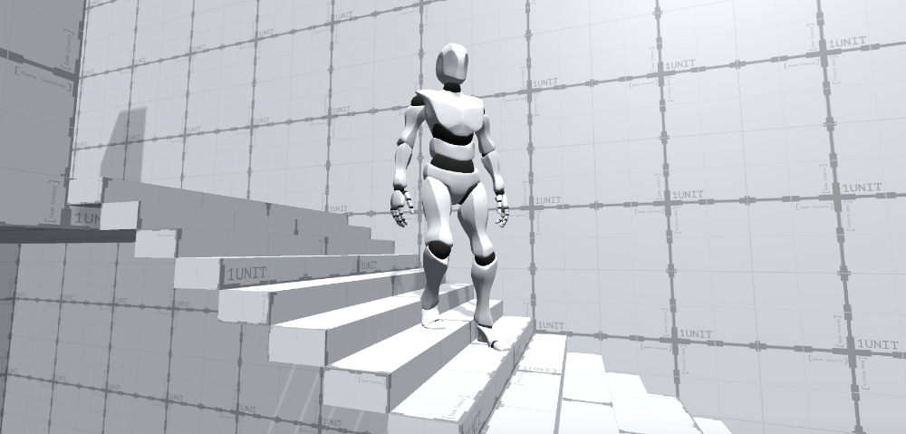
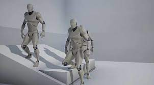
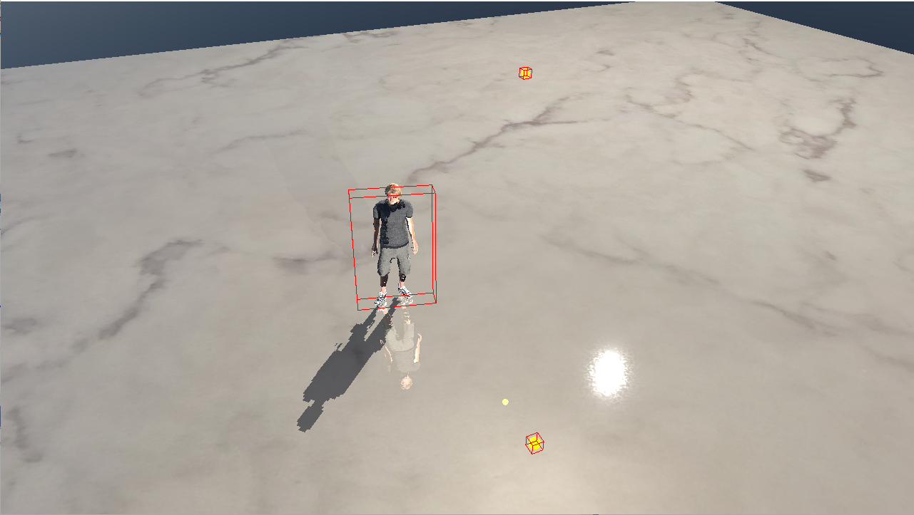

# 1주차 진행상황

## 주제선정

캐릭터 IK 구현 및 다양한 지형에 대한 캐릭터 컨트롤 구현

## 계획

크게 두 가지 목표를 설정

1. IK 구현  
   다리 -> 팔(?) 순서로 구현할 예정.
2. 지형에 따른 캐릭터 컨트롤 구현  
   다음 세 가지 지형에 IK를 구현해 볼 예정.  
   경사로 -> 언덕 -> 계단 (추후 벽타기까지..?)
   
   

기존 DX12 렌더러를 이용해서 구현 예정.

## 진행상황

IK 관련 이론 학습 중(자코비안)  
DX12 렌더러 준비 및 충돌체 준비 중
