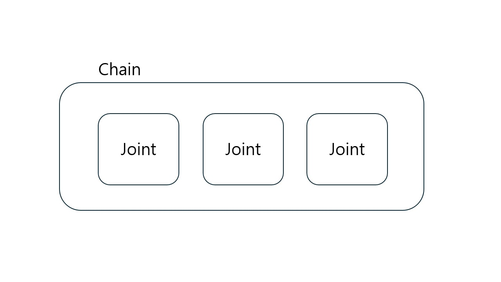
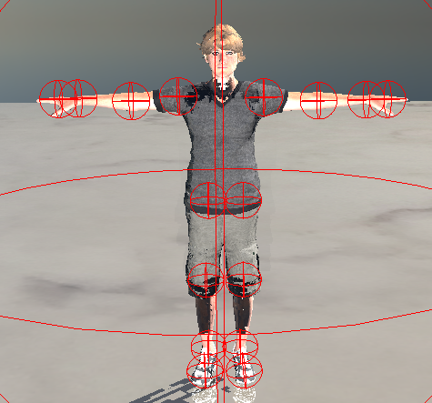
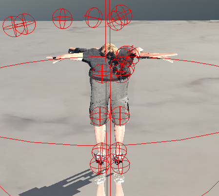

# 2주차 진행상황

## 목표

팔, 다리 IK 구현을 목표로 함.

## 진행상황

### IK를 위한 이론 학습  
forward kinematics에서 각 뼈들의 위치는 다음과 같은 관계식으로 계산됨.  
$$
p = F(\theta)
$$  

IK에서는 end-effector의 위치 변화를 통해 각 뼈들의 회전 변화를 알아야하므로 다음과 같이 자코비안 행렬을 적용하여 표현할 수 있음.
$$
\Delta p = J\Delta\theta
$$

회전각 변화량을 알기 위해서 위식을 다음과 같이 식을 계산할 수 있음.
$$
J^{-1}\Delta p = \Delta\theta
$$

자코비안 행렬의 경우, end-effector에 영향을 주는 각 관절들의 위치에서 end-effector로의 방향벡터와 x,y,z 각축을 외적하여 계산.

### 구현 계획
자코비안 행렬 계산 및 적용을 위한 준비  
- 양팔, 양다리 각각을 하나의 Chain으로 묶음.  

- end-effector(양손, 양다리)의 위치 변화량에 따라 자코비안 행렬과 역행렬을 계산하고, 이를 Chain에 포함된 각 뼈들에 적용하려함.

### 구현 상황
- 양팔, 양다리에서 IK에 관여하는 뼈들의 위치 시각화  

- end-effector를 선택 후 드래그를 통해 위치 변화 감지가 가능하도록 함
- 위치 변화를 통한 자코비안 행렬 계산 및 회전각 적용.

### 문제점
 
- 캐릭터가 이상하게 렌더링 됨.  
- 양팔의 경우, 회전이 적용되는 듯 하나, 많이 튀는(?) 현상 발생, 양팔과 연관된 다른 부위의 transform 데이터를 업데이트 하지 않아 이상하게 렌더링됨(손가락).  
- 양다리의 경우, 거의 움직이지 않음.  

### 추후 계획
- 사용하고 있는 렌더러에서 bone transform 업데이트 방식을 수정해야 함.
- 각 관절마다 회전 각의 제한을 둬야 함.