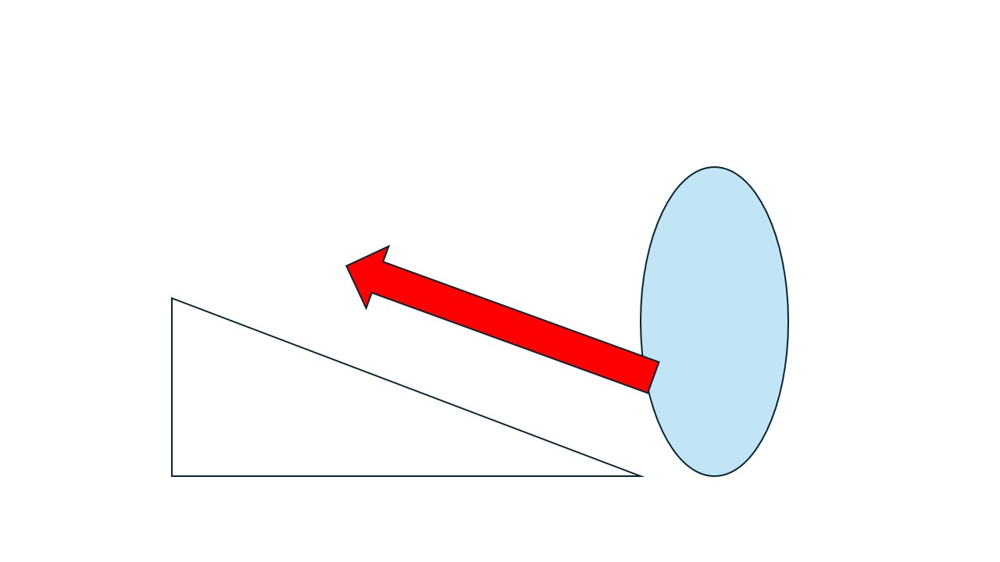

# 3주차 진행상황

## 목표

팔, 다리 IK 구현을 목표로 함.

## 진행상황

지난 주 IK 구현 중 겪었던 문제점들을 해결하는데 집중.  
문제점들은 다음과 같음.
- 계산된 회전 값들이 캐릭터에 제대로 적용이 안됨.
- 자코비안 행렬 계산을 통해 다양한 해들이 도출되어 튀는(?) 현상 발생.

### 구현 상황
- end-effector의 위치 변화에 임계값을 설정하여 자코비안 행렬 계산을 하지 않도록 설정.
- 계산된 회전 값들에 제한 값을 두어 이상한 회전이 되는 것을 막음.
- 캐릭터에 제대로 회전 값이 적용되도록 수정.   

### 추후 계획
- 경사면에 대한 캐릭터 애니메이션 IK를 구현.   
  
구현 방법 생각 중.   
경사면에 따른 캐릭터 전체 이동 방향 결정 -> 애니메이션 키 데이터 적용 -> 두 발에 대한 IK 적용.